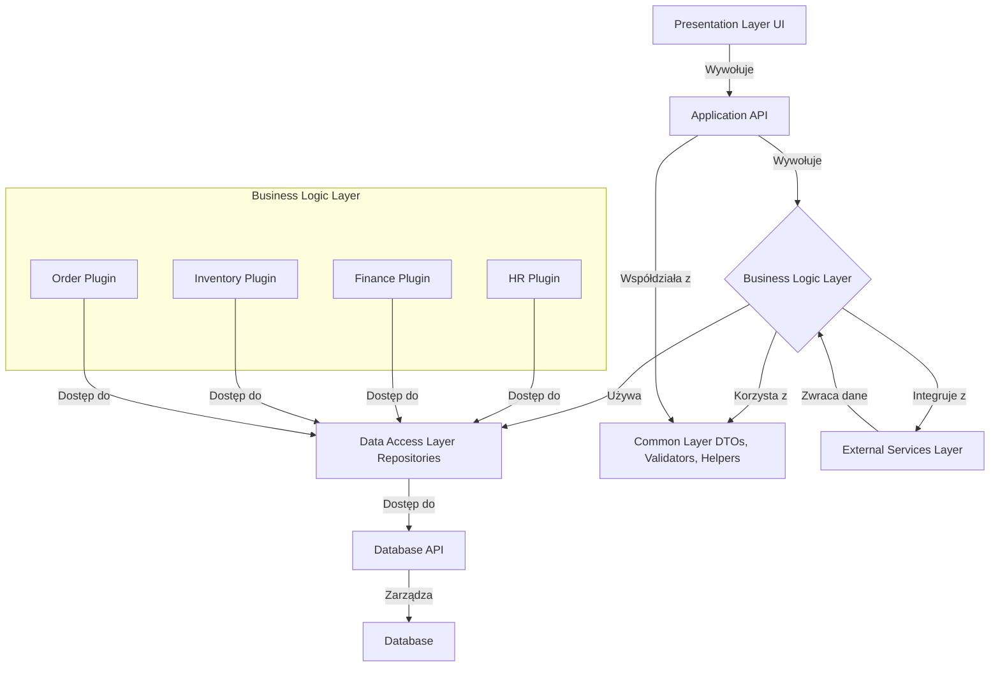

# :bee: Aquilo

## :bookmark_tabs:  Spis treści
:movie_camera: [Krótkie wprowadzenie do projektu](#krótkie-wprowadzenie-do-projektu)  
:gear: [Podstawowe moduły systemu](#podstawowe-moduły-systemu)  
:triangular_ruler: [Architektura](#architektura)  
:white_check_mark: [Funkcjonalności](#funkcjonalności)  
:computer: [Wymaganie systemowe](#wymaganie-systemowe)  
:wrench: [Instalacja i konfiguracja](#instalacja-i-konfiguracja)  
:page_facing_up: [Instrukcja](#instrukcja)  
:hammer_and_wrench: [Technologie i narzędzia](#technologie-i-narzędzia)  
:cd: [Przykładowe dane](#przykładowe-dane)  
:grey_question: [FAQ](#faq)  
:scroll: [Licencja](#licencja)  
:rocket: [Plany na przyszłość](#plany-na-przyszłość)  
:label: [Wersje](#wersje)

## Krótkie wprowadzenie do projektu
System ERP Aquilo to kompleksowe oprogramowanie służące do zarządzania wszystkimi kluczowymi procesami biznesowymi w firmie, takimi jak finanse, zasoby ludzkie, produkcja, magazynowanie czy sprzedaż. Centralizuje on dane i operacje w jednej platformie, co umożliwia lepszą kontrolę nad zasobami i procesami przedsiębiorstwa. Dzięki modularnej budowie, system ERP można łatwo rozbudowywać o dodatkowe funkcje, dostosowując go do specyficznych potrzeb danej firmy. Każdy moduł może odpowiadać za inny obszar działalności, jak HR, finanse czy logistyka, i współpracować z innymi modułami. System ERP ułatwia automatyzację procesów, poprawia efektywność i zapewnia lepszy przepływ informacji między działami. Jest skalowalny, dzięki czemu może rosnąć wraz z rozwojem firmy, co czyni go elastycznym narzędziem na długą perspektywę. Więcej na temat Aquilo znajdziesz [tutaj :link:](git/empty.md)

## Podstawowe moduły systemu
:moneybag: [Moduł Finansowy](docs/Plugins/FinancialPlugin.md)  
:busts_in_silhouette: [Moduł Zarządzania Zasobami Ludzkimi (HR)](docs/Plugins/HRPlugin.md)  
:package: [Moduł Zarządzania Magazynem](docs/Plugins/WarehouseManagementPlugin.md)  
:dollar: [Moduł Sprzedaży i Zarządzania Zamówieniami](docs/Plugins/SalesAndOrderManagementPlugin.md)  
:shopping_cart: [Moduł Zakupów](docs/Plugins/ShoppingPlugin.md)  
:factory: [Moduł Produkcji](docs/Plugins/ProductionPlugin.md)  
:chart_with_upwards_trend: [Moduł Zarządzania Projektami](docs/Plugins/ProjectManagementPlugin.md)  

## Architektura
### Diagram architektury systemu ERP Aquilo

### Struktura diagramu
Diagram składa się z pięciu głównych warstw, które wspólnie tworzą system ERP. Każda warstwa ma swoje unikalne zadania i odpowiedzialności, co umożliwia modularność i elastyczność systemu. Oto poszczególne elementy diagramu:

1. Warstwa Prezentacji (Presentation Layer UI)
Opis: Warstwa ta jest odpowiedzialna za interakcję z użytkownikami. Obejmuje wszystkie komponenty, które są widoczne dla użytkownika, takie jak formularze, widoki oraz interfejsy.
Interakcje: Komunikacja w tej warstwie odbywa się poprzez wywołania do Application API, które obsługuje żądania użytkowników.
2. Warstwa API (Application API)
Opis: Stanowi pośrednika między warstwą prezentacyjną a warstwą logiki biznesowej. API jest odpowiedzialne za przyjmowanie żądań od warstwy prezentacyjnej, przetwarzanie ich i kierowanie do odpowiednich modułów logiki biznesowej.
Interakcje: API wywołuje logikę biznesową i przekazuje jej żądania do odpowiednich modułów.  
*Szczegółową dokumentacje tej warstwy znajdziesz* [tutaj :link:](docs/instructions/Aquilo.API.md)
3. Warstwa Logiki Biznesowej (Business Logic Layer)
Moduły:
Moduł HR (HR Plugin): Obsługuje funkcje związane z zarządzaniem zasobami ludzkimi.
Moduł Finanse (Finance Plugin): Zajmuje się zarządzaniem finansami, w tym budżetowaniem i raportowaniem finansowym.
Moduł Magazyn (Inventory Plugin): Odpowiada za zarządzanie zapasami i logistyką.
Moduł Zamówienia (Order Plugin): Obsługuje procesy związane z zamówieniami i sprzedażą.
Interakcje: Każdy z modułów w warstwie logiki biznesowej korzysta z warstwy dostępu do danych (Data Access Layer) do wykonywania operacji na danych.  
*Szczegółową dokumentacje tej warstwy znajdziesz* [tutaj :link:](docs/instructions/Aquilo.API.md)
4. Warstwa Dostępu do Danych (Data Access Layer)
Opis: Warstwa ta jest odpowiedzialna za interakcję z bazą danych. Umożliwia modułom logiki biznesowej wykonywanie operacji na danych.
Interakcje:
Repozytoria: Obsługują zapytania do bazy danych, zapewniając spójną i zorganizowaną warstwę dostępu do danych.
API bazy danych (Database API): Umożliwia komunikację z bazą danych w sposób kontrolowany i uporządkowany.  
*Szczegółową dokumentacje tej warstwy znajdziesz* [tutaj :link:](docs/instructions/Aquilo.API.md)
5. Baza Danych (Database)
Opis: Fizyczna baza danych, w której przechowywane są wszystkie dane związane z systemem ERP.
Interakcje: Warstwa dostępu do danych zarządza operacjami na bazie danych poprzez API bazy danych.  
*Szczegółową dokumentacje tej warstwy znajdziesz* [tutaj :link:](docs/instructions/Aquilo.API.md)
6. Wspólna Warstwa (Common Layer)
Opis: Zawiera obiekty transferu danych (DTOs), walidatory i inne pomocnicze komponenty, które są używane przez różne moduły i warstwy.
Interakcje: Moduły logiki biznesowej oraz API korzystają z tej warstwy, aby zapewnić spójność i ułatwić wymianę danych.  
*Szczegółową dokumentacje tej warstwy znajdziesz* [tutaj :link:](docs/instructions/Aquilo.API.md)
7. Zewnętrzne Usługi (External Services Layer)
Opis: Umożliwia integrację z innymi systemami lub usługami, które mogą być wykorzystywane przez moduły logiki biznesowej.
Interakcje: Zewnętrzne usługi mogą zwracać dane do warstwy logiki biznesowej, co pozwala na rozszerzenie funkcjonalności systemu ERP.
Połączenia między modułami a warstwą logiki biznesowej
Każdy z modułów w warstwie logiki biznesowej (HR, Finanse, Magazyn, Zamówienia) korzysta z warstwy dostępu do danych, co umożliwia im realizację operacji związanych z danymi, takich jak pobieranie, dodawanie, modyfikowanie lub usuwanie danych.  
*Szczegółową dokumentacje tej warstwy znajdziesz* [tutaj :link:](docs/instructions/Aquilo.API.md)

## Funkcjonalności
:heavy_plus_sign: [Dodawanie własnych modułów systemu](docs/instructions/AddingNewFunctionalitiesToTheSystem.md)  
:pencil2: [Modyfikacja istniejących modułów systemu](docs/instructions/empty.md)  
:electric_plug: [Integracje z usługami zewnętrznymi](docs/instructions/IntegrationsWithExternalServices.md)  

## Wymaganie systemowe
* System operacyjny: Windows 10/11, macOS, Linux
* Baza danych: SQL Server
* Platforma: .NET 8 lub nowsza
* Pamięć RAM: Min. 8 GB
* Dysk twardy: Min. 10 GB wolnego miejsca na dysku

## Instalacja i konfiguracja

1. Klonowanie repozytorium
2. Instalacja zależności
3. Konfiguracja plików
4. Migracje bazy danych
5. Uruchomienie projektu

## Instrukcja

## Technologie i narzędzia
* .NET8

## Przykładowe dane

## FAQ
* Czy mogę dostosować wygląd interfejsu użytkownika?  
Tak, wygląd interfejsu można dostosować za pomocą motywów oraz edycji plików stylów w zakładce Ustawienia wyglądu.

## Autorzy
:man_technologist: Radosław Mazur

## Licencja
Aquilo ERP jest dostępny na licencji MIT. Możesz swobodnie korzystać z projektu, modyfikować go oraz dystrybuować zgodnie z warunkami licencji.

## Plany na przyszłość
:construction_worker: Dynamiczne ładowanie modułów dla UI i logiki biznesowej  
:heavy_check_mark: Diagram architektury systemu  
:x: Diagram struktury bazy danych  

## Wersje
#### Aquilo 1.0.0