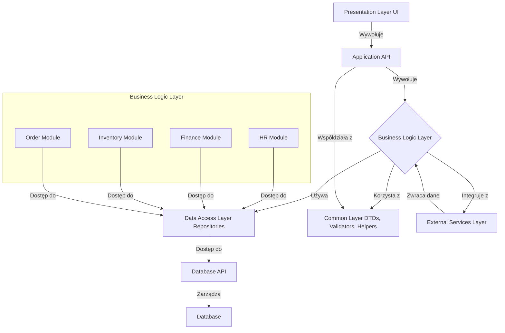

# Aquilo

## Spis treści
- [Krótkie wprowadzenie do projektu](#krótkie wprowadzenie do projektu)
- [Podstawowe moduły systemu](#podstawowe moduły systemu)
- [Architektura](#architektura)
- [Funkcjonalności](#funkcjonalności)
- [Wymaganie systemowe](#wymaganie-systemowe)
- [Instalacja i konfiguracja](#instalacja-i-konfiguracja)
- [Instrukcja](#instrukcja)
- [Technologie i narzędzia](#technologie-i-narzędzia)
- [Przykładowe dane](#przykładowe-dane)
- [FAQ](#faq)
- [Licencja](#licencja)
- [Plany na przyszłość](#plany-na-przyszłość)
- [Wersje](#wersje)

## Krótkie wprowadzenie do projektu
System ERP Aquilo to kompleksowe oprogramowanie służące do zarządzania wszystkimi kluczowymi procesami biznesowymi w firmie, takimi jak finanse, zasoby ludzkie, produkcja, magazynowanie czy sprzedaż. Centralizuje on dane i operacje w jednej platformie, co umożliwia lepszą kontrolę nad zasobami i procesami przedsiębiorstwa. Dzięki modularnej budowie, system ERP można łatwo rozbudowywać o dodatkowe funkcje, dostosowując go do specyficznych potrzeb danej firmy. Każdy moduł może odpowiadać za inny obszar działalności, jak HR, finanse czy logistyka, i współpracować z innymi modułami. System ERP ułatwia automatyzację procesów, poprawia efektywność i zapewnia lepszy przepływ informacji między działami. Jest skalowalny, dzięki czemu może rosnąć wraz z rozwojem firmy, co czyni go elastycznym narzędziem na długą perspektywę.

## Podstawowe moduły systemu
* [Moduł Finansowy](docs/modules/FinancialModule.md)
* [Moduł Zarządzania Zasobami Ludzkimi (HR)](docs/modules/HRModule.md)
* [Moduł Zarządzania Magazynem](docs/modules/WarehouseManagementModule.md)
* [Moduł Sprzedaży i Zarządzania Zamówieniami](docs/modules/SalesAndOrderManagementModule.md)
* [Moduł Zakupów](docs/modules/ShoppingModule.md)
* [Moduł Produkcji](docs/modules/ProductionModule.md)
* [Moduł Zarządzania Projektami](docs/modules/ProjectManagementModule.md)

## Architektura
### Diagram architektury systemu ERP Aquilo

### Struktura diagramu
Diagram składa się z pięciu głównych warstw, które wspólnie tworzą system ERP. Każda warstwa ma swoje unikalne zadania i odpowiedzialności, co umożliwia modularność i elastyczność systemu. Oto poszczególne elementy diagramu:

1. Warstwa Prezentacji (Presentation Layer UI)
Opis: Warstwa ta jest odpowiedzialna za interakcję z użytkownikami. Obejmuje wszystkie komponenty, które są widoczne dla użytkownika, takie jak formularze, widoki oraz interfejsy.
Interakcje: Komunikacja w tej warstwie odbywa się poprzez wywołania do Application API, które obsługuje żądania użytkowników.
2. Warstwa API (Application API)
Opis: Stanowi pośrednika między warstwą prezentacyjną a warstwą logiki biznesowej. API jest odpowiedzialne za przyjmowanie żądań od warstwy prezentacyjnej, przetwarzanie ich i kierowanie do odpowiednich modułów logiki biznesowej.
Interakcje: API wywołuje logikę biznesową i przekazuje jej żądania do odpowiednich modułów.
*Szczegółową dokumentacje tej warstwy znajdziesz* [`tutaj`](docs/instructions/Aquilo.API.md)
3. Warstwa Logiki Biznesowej (Business Logic Layer)
Moduły:
Moduł HR (HR Module): Obsługuje funkcje związane z zarządzaniem zasobami ludzkimi.
Moduł Finanse (Finance Module): Zajmuje się zarządzaniem finansami, w tym budżetowaniem i raportowaniem finansowym.
Moduł Magazyn (Inventory Module): Odpowiada za zarządzanie zapasami i logistyką.
Moduł Zamówienia (Order Module): Obsługuje procesy związane z zamówieniami i sprzedażą.
Interakcje: Każdy z modułów w warstwie logiki biznesowej korzysta z warstwy dostępu do danych (Data Access Layer) do wykonywania operacji na danych.
4. Warstwa Dostępu do Danych (Data Access Layer)
Opis: Warstwa ta jest odpowiedzialna za interakcję z bazą danych. Umożliwia modułom logiki biznesowej wykonywanie operacji na danych.
Interakcje:
Repozytoria: Obsługują zapytania do bazy danych, zapewniając spójną i zorganizowaną warstwę dostępu do danych.
API bazy danych (Database API): Umożliwia komunikację z bazą danych w sposób kontrolowany i uporządkowany.
5. Baza Danych (Database)
Opis: Fizyczna baza danych, w której przechowywane są wszystkie dane związane z systemem ERP.
Interakcje: Warstwa dostępu do danych zarządza operacjami na bazie danych poprzez API bazy danych.
6. Wspólna Warstwa (Common Layer)
Opis: Zawiera obiekty transferu danych (DTOs), walidatory i inne pomocnicze komponenty, które są używane przez różne moduły i warstwy.
Interakcje: Moduły logiki biznesowej oraz API korzystają z tej warstwy, aby zapewnić spójność i ułatwić wymianę danych.
7. Zewnętrzne Usługi (External Services Layer)
Opis: Umożliwia integrację z innymi systemami lub usługami, które mogą być wykorzystywane przez moduły logiki biznesowej.
Interakcje: Zewnętrzne usługi mogą zwracać dane do warstwy logiki biznesowej, co pozwala na rozszerzenie funkcjonalności systemu ERP.
Połączenia między modułami a warstwą logiki biznesowej
Każdy z modułów w warstwie logiki biznesowej (HR, Finanse, Magazyn, Zamówienia) korzysta z warstwy dostępu do danych, co umożliwia im realizację operacji związanych z danymi, takich jak pobieranie, dodawanie, modyfikowanie lub usuwanie danych.

## Funkcjonalności
* [Dodawanie własnych modułów systemu](docs/instructions/AddingNewFunctionalitiesToTheSystem.md)
* [Integracje z usługami zewnętrznymi](docs/instructions/IntegrationsWithExternalServices.md)

## Wymaganie systemowe

## Instalacja i konfiguracja

1. Klonowanie repozytorium
2. Instalacja zależności
3. Konfiguracja plików
4. Migracje bazy danych
5. Uruchomienie projektu

## Instrukcja

## Technologie i narzędzia
* .NET8

## Przykładowe dane

## FAQ

## Autorzy i wkład

## Licencja

## Plany na przyszłość

## Wersje